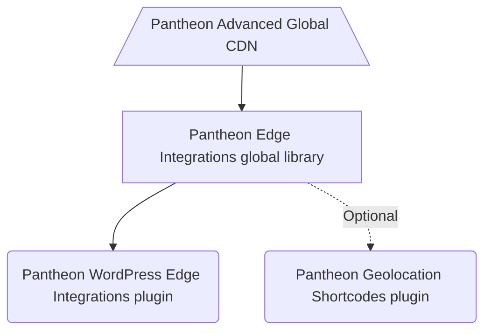

# Pantheon Edge Integrations WordPress SDK

[](https://pantheon.io/docs/oss-support-levels#unsupported)  

Welcome to the Pantheon Edge Integrations WordPress SDK!

This repository serves as a one-stop shop for integrating your WordPress site on Pantheon with our Edge Integrations toolset.

## Architecture

The diagram below illustrates the general overview of what this SDK provides and how the pieces fit together.



### Description

The Edge Integrations WordPress SDK is made up of several components that, in addition to the documentation stored in this repository, are all installed automatically when you `composer require` the project in your WordPress project root.

#### Pantheon Advanced Global CDN
Edge Integrations start with the "edge" itself, the CDN layer that is the last stop before a page is rendered in your browser. Pantheon's [Advanced Global CDN](https://pantheon.io/docs/guides/professional-services/advanced-global-cdn) has enabled Varnish configuration rules on our AGCDN platform to allow for geolocation information and interest tracking data to be sent back and forth with the CDN, enabling CDN caching for content personalized by those parameters. AGCDN is the first step for Pantheon Edge Integrations and allows us to render cached versions of personalized pages.

#### Pantheon Edge Integrations global library
The [Pantheon Edge Integrations](https://github.com/pantheon-systems/pantheon-edge-integrations) global library allows developers to interact with the header data sent to and from the CDN. This is a low level interface that simplifies the process of communicating with and interpretting headers sent from the CDN. It's important to note that the Edge Integrations library is built as a generic, CMS-agnostic PHP package, and is used as the base of both the WordPress and the Drupal implementations.

#### Pantheon WordPress Edge Integrations plugin
The [WordPress Edge Integrations](https://github.com/pantheon-systems/pantheon-wordpress-edge-integrations) plugin adds namespaced functions (e.g. `Pantheon\EI\WP\get_geo()` and `Pantheon\EI\WP\get_interest()`), hooks and filters that can empower WordPress developers to use our edge integrations for personalization without directly interfacing with the global library. It includes opinionated helper functions that guide the parameters and return values of our functions as well as implements interest tracking based on post categories (by default).

#### Pantheon Geolocation Shortcodes plugin
The [Pantheon Geolocation Shortcodes](https://github.com/pantheon-systems/pantheon-geolocation-shortcodes) plugin is an optional addition that can be included if all you want to do is display specific content in posts and pages to some geographic regions, but not other geographic regions. Parameters exist to display content by continent, country, region and city as well as allowing for conditions like `not_continent` and `not_city`.

## Setup

### Installing into a project with Integrated Composer.

Adding Edge Integrations support to your Integrated Composer project is simple and is the recommended means of adding the Edge Integrations WordPress SDK.

#### Requiring the Composer package

To get started, all you need to do is to add this repository as a dependency:

```bash
composer require pantheon-systems/edge-integrations-wordpress-sdk
```

That command will add this repository to your `/vendor` directory, as well as all of the dependencies, which include a [global, CMS-agnostic PHP library](https://github.com/pantheon-systems/pantheon-edge-integrations) and a [WordPress plugin](https://github.com/pantheon-systems/pantheon-wordpress-edge-integrations) as well as all of the documentation for the SDK.

Alternately, you can add `pantheon-systems/edge-integrations-wordpress-sdk` as a dependency to your project's `composer.json` file and run `composer install`.

### Installing manually

If you aren't running a project with Integrated Composer but you _do_ use Composer otherwise, you can still get started with the Edge Integrations WordPress SDK without too much trouble. This still assumes you have Composer installed on at least one machine.

#### Step 1: Clone or `composer require` the WordPress Edge Integrations plugin

First, you'll need to get a copy of the [WordPress Edge Integrations plugin](https://github.com/pantheon-systems/pantheon-wordpress-edge-integrations). Clone or download the plugin into your `wp-content/plugins` directory.

```bash
git clone git@github.com:pantheon-systems/pantheon-wordpress-edge-integrations.git
```

Alternately, you can use Composer to download the package.

```bash
composer require pantheon-systems/pantheon-wordpress-edge-integrations
```

#### Step 2: Install Pantheon Edge Integrations library

Once you have the plugin downloaded, you'll need to run `composer install` to get the Pantheon Edge Integrations library. `cd` into the plugin's directory and run `composer install`. From the `wp-content/plugins` directory, run the following commands:

```bash
cd pantheon-wordpress-edge-integrations
composer install
```

This will install `pantheon-edge-integrations` into the plugin's `vendor` directory. The plugin itself will handle loading the library if it's installed.
